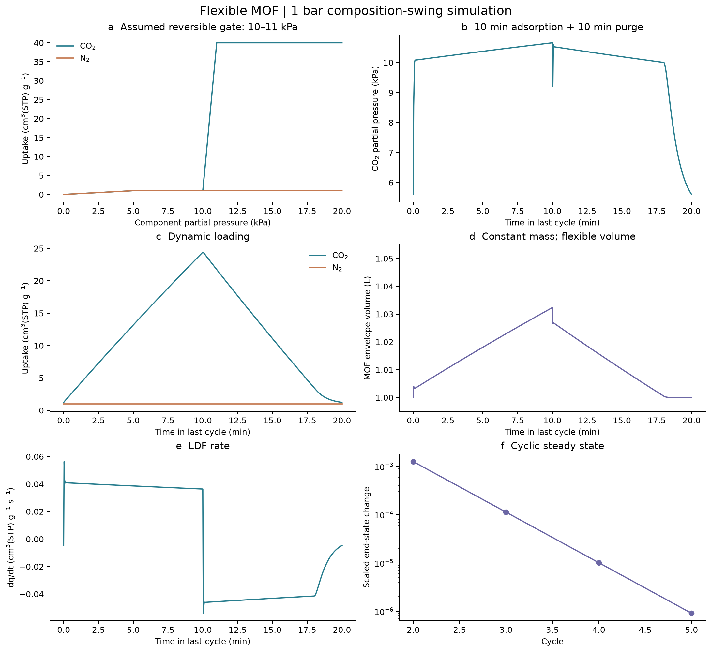
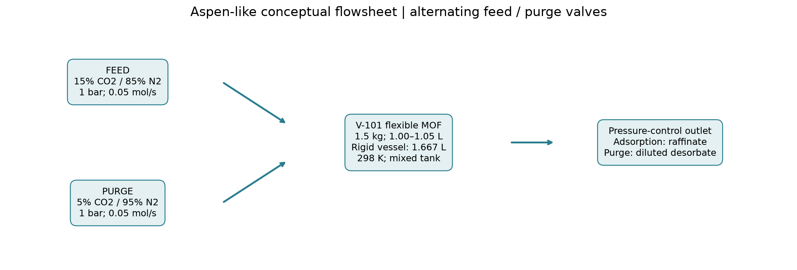

# 柔性 MOF 开门吸附／混合气吹扫：计算报告

## 结论

输入模板可运行。当前采用 SciPy BDF 的等温二元全混床模型，已接入插件的 run_model 路由。
IDAES/Pyomo 环境已检查可用，但本柔性单元尚未实现为 IDAES 单元，不能把此结果称为 IDAES 求解。
用户最后指定的是 1 bar、95% N₂＋5% CO₂ 吹扫，故实际为**等压组成切换**，没有抽真空步骤。

| 指标 | 600 s 吸附＋600 s 吹扫 | 1800 s 吸附＋1800 s 吹扫 |
|---|---:|---:|
| CSS 循环数 | 5 | 2 |
| 动态 CO₂ 工作容量 / cm³(STP)/g | 23.1847 | 39.0000 |
| 净 CO₂ 释放 / mol/周期 | 1.552800 | 2.612369 |
| 吹扫尾气平均 CO₂ / % | 9.676 | 7.680 |
| 净回收率 / % | 34.507 | 19.351 |
| 吹扫末床层 CO₂ 分压 / kPa | 5.6024 | 5.0025 |

平均尾气浓度按整个吹扫阶段的组分累计摩尔量计算。净释放扣除吹扫入口自带 CO₂，包含床层气相库存切换；纯固相释放由吸附量变化另算。
长接触时间可能提高单位周期容量，但同时增加吹扫量、周期时间和进料损失，不自动代表更优工艺。

## 输入、来源与单位

用户值：MOF 实体体积 1.0 L；密度 1.5 g/cm³；质量保持 1.5 kg；开门膨胀 5%；
CO₂ 在 5 kPa 分压为 1、15 kPa 为 40 cm³(STP)/g；10–11 kPa 内陡升；N₂ 约 1 cm³(STP)/g；
吸附入口 15% CO₂＋85% N₂，总压 1 bar；吹扫入口 5% CO₂＋95% N₂，总压沿用 1 bar。
5→15→5 kPa 是入口组成对应的 CO₂ 分压变化，床层内分压是求解结果。

假设值：298 K 恒温；两股气流基准均为 0.05 mol/s；初始空隙率 0.4；刚性容器体积 1.667 L；
全混单床；结构速率 0.1 s⁻¹；CO₂ LDF 0.02 s⁻¹；N₂ LDF 0.05 s⁻¹；阀导纳 0.001 mol/(s·Pa)。
缺少关门滞后数据，暂取吸附／解吸共用同一 10–11 kPa 门控区间，不虚构滞后环。
用户未给低压外推，0–5 kPa 取线性 Henry 段，5 kPa 以上低压基线取平台；N₂ 同样延拓。
这些是原型假设，竞争吸附与压力外推须用实验数据替换。

STP=273.15 K、101325 Pa；1 mol=22.414 L(STP)。1 cm³(STP)/g≈0.044615 mol/kg。
平衡工作容量 39 cm³(STP)/g，对应整床 58.5 L(STP)、2.609979 mol。
膨胀不改变质量；实体体积最大 1.05 L，密度降为约 1.4286 g/cm³；容器气相空隙相应缩小。

## 流程与计算原理

进料／吹扫切换阀 → 柔性 MOF 全混床 → 压力控制出口。吸附尾气与吹扫尾气分开累计。

- 门控目标 f*=clip[(pCO₂−10 kPa)/(1 kPa),0,1]；df/dt=kf(f*−f)。
- qCO₂*=qbase(pCO₂)+(qhigh−qlow)f；qN₂* 为低容量平台及低压线性延拓。
- dqi/dt=ki(qi*−qi)，q 单位 mol/kg。
- Vs=Vs0(1+0.05f)，Vg=Vvessel−Vs，pi=niRT/Vg；yi=ni/Σni。
- dni/dt=Fin·yi,in−Fout·yi−m·dqi/dt。固相膨胀通过 Vg 耦合气体压力与出口流量。
- Fin=Fbase+Kv·max(Ptarget−P,0)，Fout=Kv·max(P−Ptarget,0)。这是近似压力控制，实际总压有小幅偏离。
- 状态为两组分气相摩尔量、两组分固相吸附量、开门程度，以及入口／出口累计组分摩尔量。
- 初始床层在吹扫气组成及低吸附量下平衡；重复两步直到末端气相、固相和结构状态归一化差小于 1e−6。

## 回收率的基准

600 s 工况吹扫入口 CO₂=1.500000 mol；吹扫出口 CO₂=3.052800 mol；
差值=1.552800 mol；吸附入口 CO₂=4.500000 mol。
净回收率=该差值／吸附入口 CO₂。不将吹扫入口 CO₂ 当成捕集量。
这是净衡算定义，未用同位素或分子标记追踪入口来源；吹扫尾气并非高纯 CO₂ 产品。

## 合理性与数值验证

基准最大组分衡算误差 5.364e-12 mol；末端 CSS 差 9.083e-07。
误差为每周期 Fin−Fout−Δ(气相＋固相) 的最大绝对组分差；这是方程积分一致性检查，非独立物理验证。
时间步长上限 2→0.5 s，rtol 1e−7→1e−9、atol 1e−10→1e−12：
净释放相对变化 4.428e-09，工作容量相对变化 9.584e-09。
两组数值设置和长接触工况均要求 CSS；检查负库存、开门程度和体积范围。

恒温、无轴向梯度且无实验门控动力学／滞后数据，会限制预测精度。
没有能量方程、吸附热、换热设计、压降、材料疲劳与混合气竞争拟合；不报告能耗或工业验证结论。
平衡点复现只表明输入本构满足指定锚点，不等于实验验证。

## 复现

在已安装的 idaes-process 环境中运行 `python scripts/run_gate_open_demo.py`。
模板：`assets/templates/gate_open_psa.yaml`；单独运行可用
`python scripts/run_model.py assets/templates/gate_open_psa.yaml --output-dir runs/gate_open`。
本目录 baseline/refined/long_contact 保留 YAML、CSV、JSON 原始输出；equilibrium_curves.csv 保存本构曲线。
