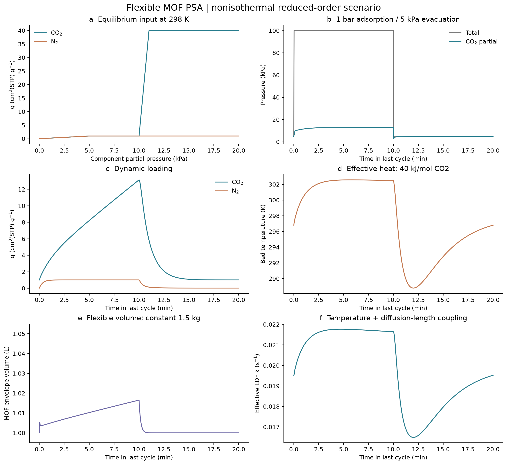
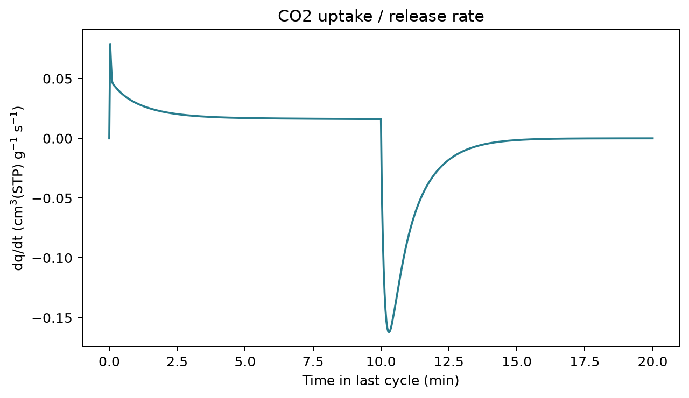
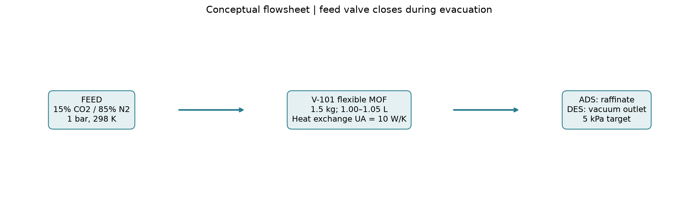

# 柔性 MOF 非等温 PSA 报告

最终工况：15% CO₂＋85% N₂ 在总压 1 bar 下吸附，关闭进料，直接抽气至总压 5 kPa。无混合气吹扫。

模型已接入插件 run_model；使用 SciPy BDF，IDAES/Pyomo 环境已检查可用，但柔性单元尚非 IDAES 原生单元。所有结果为假设参数下的模拟。

## 计算结果

|工况|工作容量 cm³(STP)/g|CO₂ mol/周期|抽气产品 CO₂ %|回收率 %|温度 K|CSS 周期|
|---|---:|---:|---:|---:|---|---:|
|baseline|12.1497|0.81515|90.23|18.10|288.79–302.57|5|
|refined|12.1497|0.81515|90.23|18.10|288.79–302.57|5|
|long_contact|30.0223|2.01116|95.78|14.89|283.65–302.60|3|
|fixed_geometry|12.1502|0.81527|90.18|18.10|288.79–302.58|5|
|fixed_gate_temperature|23.3998|1.56726|94.63|34.80|281.87–307.93|3|

baseline：600 s 吸附＋600 s 抽气；refined：同工况更严求解；long_contact：各1800 s；fixed_geometry：取消5%膨胀，保留门控与热模型；fixed_gate_temperature：保留能量方程，但关闭门控阈值温度外推。后两项仅用于识别模型假设影响。

## 初始参数与来源

用户给定：实体体积1 L、密度1.5 g/cm³、开门膨胀5%；CO₂在5 kPa为1、15 kPa为40 cm³(STP)/g，10–11 kPa陡升；N₂约1 cm³(STP)/g；吸附总压1 bar、解吸总压5 kPa；有效热约40 kJ/mol。

假设：1 L指晶体实体包络体积，因此质量1.5 kg；初始床空隙率0.4，刚性容器1.667 L；298 K进气／环境；CO₂/N₂参考LDF系数0.02/0.05 s⁻¹；结构响应0.1 s⁻¹；晶体特征长度10 μm；扩散活化能15 kJ/mol；固体热容1000 J/(kg·K)、容器热容500 J/K、气体Cv=25 J/(mol·K)、UA=10 W/K。吸附基准流量0.05 mol/s，入口控制器可补气维持压力；阀导纳0.001 mol/(s·Pa)，尚未匹配实际真空泵能力。

STP=273.15 K、1 atm。39 cm³(STP)/g对应58.5 L(STP)，约2.610 mol；这是298 K平衡工作容量，不是任何有限周期的保证值。低于5 kPa分压的CO₂/N₂容量线性延拓至零，不把N₂低容量平台延伸到真空零压。实际抽气末CO₂分压小于等于总压5 kPa，故末负载可略小于1。

## 晶体体积与传质

膨胀时质量保持不变，实体体积增加。在各向同性膨胀假设下：

\[
V_s=V_{s,0}(1+0.05f),\qquad
L=L_0(1+0.05f)^{1/3},\qquad
V_g=V_{vessel}-V_s.
\]

完全开门时 10 um -> 10.164 um；若扩散系数 D 不变，仅扩散长度效应为：

\[
\frac{k_{geom}}{k_{geom,0}}=(1.05)^{-2/3}=0.9680.
\]

因此几何长度单独使 k 降低约 3.2%；密度降至 1.4286 g cm$^{-3}$，床层空隙率从 0.40 变为约 0.37。晶体尺寸使用一致的特征长度定义；孔口开度对 D、缺陷、裂纹和粒间阻力的额外影响需要数据。

温度和几何长度共同修正 LDF 系数：

\[
k_i(T,f)=k_{i,0}\exp\left[-\frac{E_{a,i}}{R}\left(\frac{1}{T}-\frac{1}{T_0}\right)\right](1+0.05f)^{-2/3},
\qquad
\frac{dq_i}{dt}=k_i(T,f)(q_i^*-q_i).
\]

## 热与结构模型

40 kJ mol$^{-1}$ 暂按每摩尔 CO2 的有效吸附/结构热量幅值处理，包含结构变化相关热，不再额外加入一份相变热。未按每摩尔框架化学式计算；若该数值实际以框架摩尔为基准，需要补充化学式和摩尔质量。

控制体能量采用：

\[
U=(mC_s+C_{wall}+n_gC_v)T-mE_{bind}q_{CO_2},
\qquad E_{bind}=40000-R T_0.
\]

\[
\frac{dU}{dt}=F_{in}C_pT_{in}-F_{out}C_pT-UA(T-T_{amb}),
\qquad C_p=C_v+R.
\]

吸附放热、解吸吸热、抽气显热和床壁换热均进入；晶体/气相间的膨胀功作为控制体内部能量耦合，不再当成外部功重复加入。当前没有计算真空泵功。

门控在参考温度 T$_0$=298 K 时为：

\[
f^*=\operatorname{clip}\left(\frac{p_{CO_2}-10\,\mathrm{kPa}}{1\,\mathrm{kPa}},0,1\right),
\qquad
\frac{df}{dt}=k_f(f^*-f).
\]

非等温时使用工程化的温度平移：

\[
p_{gate}(T)=p_{gate}(T_0)\exp\left[\frac{H_{eff}}{R}\left(\frac{1}{T_0}-\frac{1}{T}\right)\right].
\]

升温提高开门压力、降温降低开门压力。这不是由柔性框架自由能推导出的相边界；`fixed_gate_temperature` 对照用于显示这一假设的影响。没有关门滞后数据，因此没有加入固有滞后环，但有限速率仍会产生动态滞后。

## 建模、衡算与流程

气相 n$_i$、固相 q$_i$、结构 f 和温度 T 共同积分：

\[
p_i=\frac{n_iRT}{V_g},\qquad y_i=\frac{n_i}{\sum_j n_j},
\qquad
\frac{dn_i}{dt}=F_{in}y_{i,in}-F_{out}y_i-m\frac{dq_i}{dt}.
\]

抽气时 F$_{in}$=0；出口按目标压力的有限导纳移除实时组成的气体，不把解吸气相固定为 15% CO2。

回收率和产品纯度分别定义为：

\[
\eta_{CO_2}=\frac{N_{CO_2,out}^{des}}{N_{CO_2,in}^{ads}},
\qquad
x_{CO_2,des}=\frac{N_{CO_2,out}^{des}}{\sum_iN_{i,out}^{des}}.
\]

固相工作容量单独使用周期内 q$_{max}$-q$_{min}$ 计算，不把容器初始气相库存当成固相捕集量。

## 数值检查与边界

末周期CSS差=9.475e-08，基准最大组分衡算差=1.804e-12 mol；最大能量积分差=5.212e-07 J。求解器BDF，rtol=1e−7、atol=1e−10、最大步长2 s；refined改为1e−9、1e−12、0.5 s，产品量相对变化=4.501e-09，工作容量相对变化=4.506e-09。

基准最后周期总压范围5.0000–100.0489 kPa；温度288.79–302.57 K；MOF最大体积1.016533 L。记录实际压力，阀模型并非严格代数恒压。

这些检查证明数值方程闭合，不能验证热容、门控温度关系、扩散参数或工业性能。没有实验混合气等温线、孔内竞争模型、分布式温度／浓度梯度、吸附热分离测量及疲劳数据；应优先用DSC/吸附量热、原位变温结构及动力学数据替换假设。

## 文件与复现

模板 assets/templates/gate_open_psa.yaml；运行 `conda run -n idaes-process python scripts/run_gate_open_demo.py`。baseline/refined/long_contact及两个敏感性目录保存每个工况YAML、profiles.csv、streams.csv、metrics.csv与summary.json；comparison.csv和verification.json为可追溯比较。旧gate_open_psa目录保留之前吹扫试算，已被本最终工况取代。
