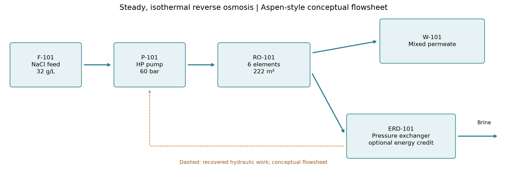
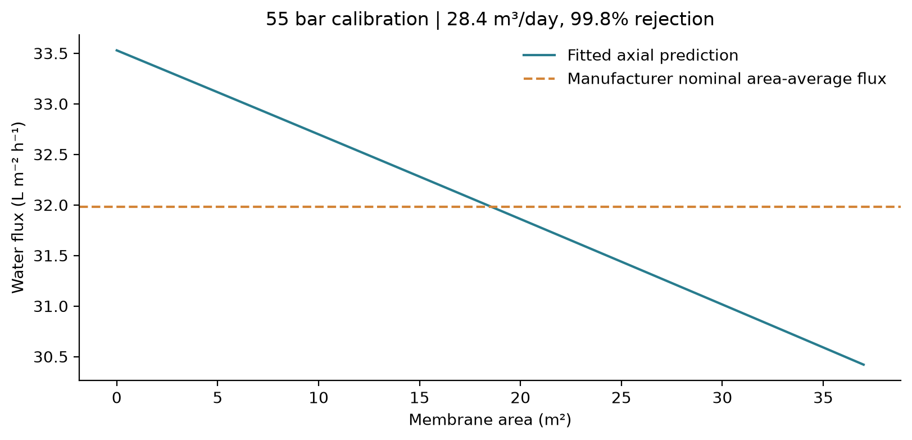
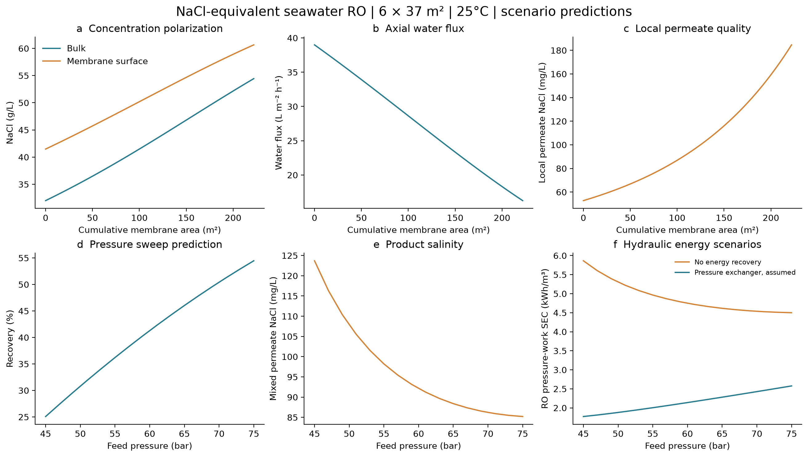
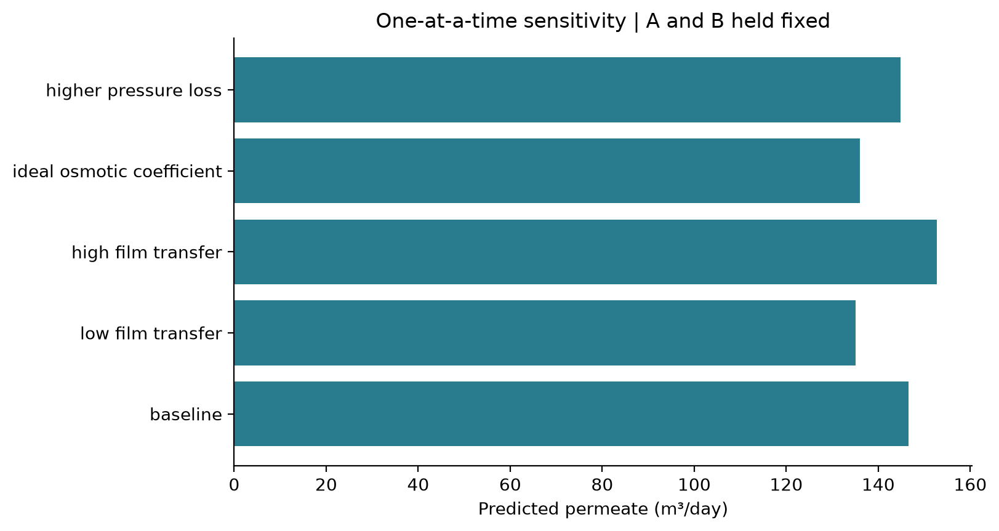

# 海水反渗透脱盐 / Seawater reverse osmosis

## 1. 实际数据及证据 / Source data and evidence

本案例采用 DuPont FilmTec SW30HRLE-400 官方产品数据表（45-D00967-en，Rev. 8，January 2026，第 1 页）。数据为厂商标准测试下的标称性能；没有公开逐点原始实验或误差棒。访问日期：2026-09-13。

Manufacturer nominal values, not a raw experimental dataset. A and B are calibrated to the two performance targets; this is not independent experimental validation.

| Quantity / 参数 | Published value / 公布值 |
|---|---|
| Active membrane area / 有效面积 | 37 m² |
| Feed NaCl / 进水 NaCl | 32,000 ppm |
| Pressure / 压力 | 55 bar (800 psi, rounded in source) |
| Temperature / 温度 | 25°C |
| Element recovery / 单元件回收率 | 8% |
| Permeate / 产水 | 28.4 m³/day |
| Stabilized salt rejection / 稳定脱盐率 | 99.8% |
| Minimum rejection / 最低脱盐率 | 99.65% |
| Boron / 硼 | 5 ppm feed, 92% rejection; excluded here |

数据表说明单支元件产水量可能变动，但不低于标称值的 85%。这不是对称置信区间。本模型按 32,000 ppm 约等于 32 kg/m³、恒密度 1000 kg/m³ 处理，保留 ppm 定义和真实盐水密度带来的换算误差。pH 8 与硼存在于原测试条件中，但不进入本二组分模型；不能据此判断硼去除或饮水安全。

## 2. 工况与初始参数 / Operating basis

模拟为稳态，无动态初始条件。入口边界为 32 g/L NaCl、25°C、14.79167 m³/h；进料流量由标称产水 / 8% 回收率推得。设计情景采用 6 支串联、总膜面积 222 m²、入口压力 60 bar、渗透侧表压 0 bar。55 和 60 bar 都作为跨膜压力的工程表压基准。

Steady axial model, with no time-domain initial conditions. Six serial elements, no interstage feed or recycle, and mixed collection of local permeate streams.

| Assumed parameter / 假设参数 | Value / 数值 |
|---|---|
| Liquid-film mass transfer k / 液膜传质 | 0.15 m/h |
| Osmotic coefficient phi / 渗透系数 | 0.93, constant |
| Pressure loss / 单支膜压降 | 0.15 bar |
| Pump efficiency / 高压泵效率 | 85% |
| Pressure exchanger efficiency / 压力交换效率 | 95% |
| Density / 密度 | 1000 kg/m³, constant |
| Pyomo mesh / 离散网格 | 30, 60, 120 cells |

以上传质、热力学近似与设备效率都是情景假设，未由数据表给出。标定 A = 1.42744 L m⁻² h⁻¹ bar⁻¹；B = 0.04966 L m⁻² h⁻¹。因为只有两个性能目标，固定 k、phi 和压降后拟合 A、B；不能同时辨识这些未知参数。



## 3. 建模与计算原理 / Model equations

液态反渗透采用溶解扩散与膜表面浓差极化方程。与 WaterTAP 官方说明的 SD / film 方程形式一致。本实现是在 IDAES FlowsheetBlock 上编写自定义 Pyomo 方程，并用 IPOPT 求解；没有调用 WaterTAP 原生 RO 单元。SciPy DOP853 提供独立参考积分。

Engineering units: Q in m³/h, C in kg/m³, membrane coordinate a in m², J in m/h, pressure in bar. The reported water flux is the dilute-permeate volumetric-flux approximation.

$$J_v=A[(P_f-P_p)-(\pi_m-\pi_p)]$$

$$J_s=B(C_m-C_p),\qquad C_p=J_s/J_v$$

$$C_m=C_p+(C_b-C_p)\exp(J_v/k)$$

$$\pi(C)=2\phi RTC/M_{NaCl},\qquad M_{NaCl}=0.05844277\ \mathrm{kg/mol}$$

$$\frac{dQ}{da}=-J_v,\qquad \frac{d(QC_b)}{da}=-J_v C_p$$

$$P_f(a)=P_{in}-\Delta P_{element}\,a/A_{element}$$

$$R=Q_p/Q_f,\qquad r_s=1-C_{p,mixed}/C_f$$

$$SEC_0=\frac{P_f Q_f}{36\eta_p Q_p}$$

$$SEC_{PX}=\frac{P_f Q_f-\eta_{PX}P_bQ_b}{36\eta_p Q_p}$$

SEC 单位为 kWh/m³。压力交换器情景以回收压力功抵扣高压泵液压负荷；不含详细旁路、混合损失、增压泵及效率曲线。不含取水、预处理、后处理和其他辅机用电。等温模型未求解热量衡算；这些数值是压力功估计。

## 4. 标定与预测 / Calibration and prediction



图中虚线为厂商面积平均标称通量，实线为标定后局部通量预测；没有把局部预测当成实验测量。拟合目标为 log(预测产水/28.4) 与 log(预测产水盐度/64)，同等权重。

| Baseline prediction / 基准预测 | Value / 数值 |
|---|---|
| Product / 产水 | 146.574 m³/day |
| Recovery / 回收率 | 41.289% |
| Mixed product NaCl / 产水盐度 | 92.152 mg/L |
| Salt rejection / 脱盐率 | 99.7120% |
| Brine NaCl / 浓水盐度 | 54.439 g/L |
| Feed osmotic pressure / 进水渗透压 | 25.246 bar |
| SEC without ERD / 无能量回收 | 4.749 kWh/m³ |
| SEC with assumed PX / 假设压力交换器 | 2.140 kWh/m³ |

厂商数据表没有六支串联膜的实测结果，因此不能把下面的串联系统结果称为实际验证。在同样的 55 bar 入口压力下，本模型预测六支串联产水 128.550 m³/day、回收率 36.21%、混合产水盐度 98.21 mg/L。简单将单元件标称产水量乘以 6 得到 170.4 m³/day，会高估串联结果约 24.6%；这是因为后段主体盐度、膜面浓差极化和渗透压逐步升高。60 bar 基准情景相对该线性估算低 14.0%，但压力更高，不能与 55 bar 标称点直接作一一对应的误差判断。

The one-element calibration reproduces the manufacturer nominal flow and rejection by construction. It is a calibration check, not independent validation. The six-element train comparison is a model prediction because no matching train measurement was supplied.



沿程取走水使主体及膜表面盐度升高，因此渗透压升高、净驱动力下降、通量衰减。后段局部产水盐度比前段高。混合产水盐度按产水流量加权，不能简单平均局部浓度。提高入口压力通常提高本模型的回收率；能耗由泵、浓水流量和压力回收共同决定。

## 5. 合理性与数值检查 / Checks and limitations

盐衡算误差 2.387e-14 kg/h；水衡算误差 -9.095e-13 kg/h。参考积分加严容差的产水相对差 2.320e-10。120 格 Pyomo 与参考积分的产水相对差 3.816e-06。完整网格与残差见 convergence.json。

数值收敛检验证明同一方程组求解稳定，并不能证明模型能够准确预测真实海水装置。这里没有独立工况实验验证；缺少真实海水各离子、非理想活度、膜污染、压降关联式及膜寿命数据。

Sensitivity runs below hold fitted A and B fixed. These are assumption tests, not confidence intervals or additional measured data.

| Case / 情景 | Product m³/day | Recovery % | Product mg/L |
|---|---:|---:|---:|
| baseline | 146.574 | 41.29 | 92.15 |
| low film transfer | 135.071 | 38.05 | 103.76 |
| high film transfer | 152.780 | 43.04 | 86.62 |
| ideal osmotic coefficient | 135.996 | 38.31 | 95.56 |
| higher pressure loss | 144.809 | 40.79 | 92.77 |



32 g/L NaCl 只代表海水级盐度的等效体系。模型不能预测 Na/Mg、Li/Mg 或硫酸根/氯离子的选择性。离子分离需要各离子组成、活度、膜电荷、分配与迁移参数，以及电中性约束；可进一步采用纳滤 DSPM-DE、电渗析 Nernst-Planck 或水相离子交换模型。真实海水还应考虑结垢及硼；本案例不作为饮水合格证明。

## 6. 复现与资料 / Reproduction and sources

Run from the repository root in the idaes-process environment:

```bash
python scripts/run_seawater_ro_demo.py
python scripts/render_reports.py --only seawater_ro_report
python -m pytest -q
```

输入、数据转录、标定、扫描、物料流与求解日志均保存在本结果目录。源 PDF 不作为自有许可文件重新分发；提供原始链接、版本、页码与 SHA-256，便于复查。

1. [DuPont original product data sheet](https://www.dupont.com/content/dam/dupont/amer/us/en/water-solutions/public/documents/en/RO-FilmTec-SW30HRLE-400-PDS-45-D00967-en.pdf), Rev. 8, January 2026, pp. 1-2.
2. [WaterTAP reverse osmosis equations](https://watertap.readthedocs.io/en/stable/technical_reference/unit_models/reverse_osmosis_0D.html), WaterTAP 1.7.0 documentation accessed 2026-09-13; used for equation form, not parameter values.
