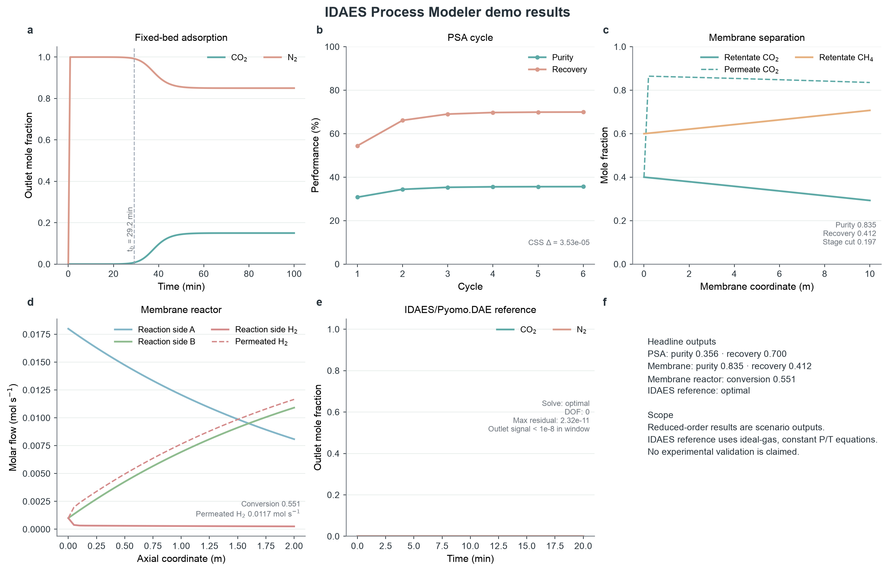
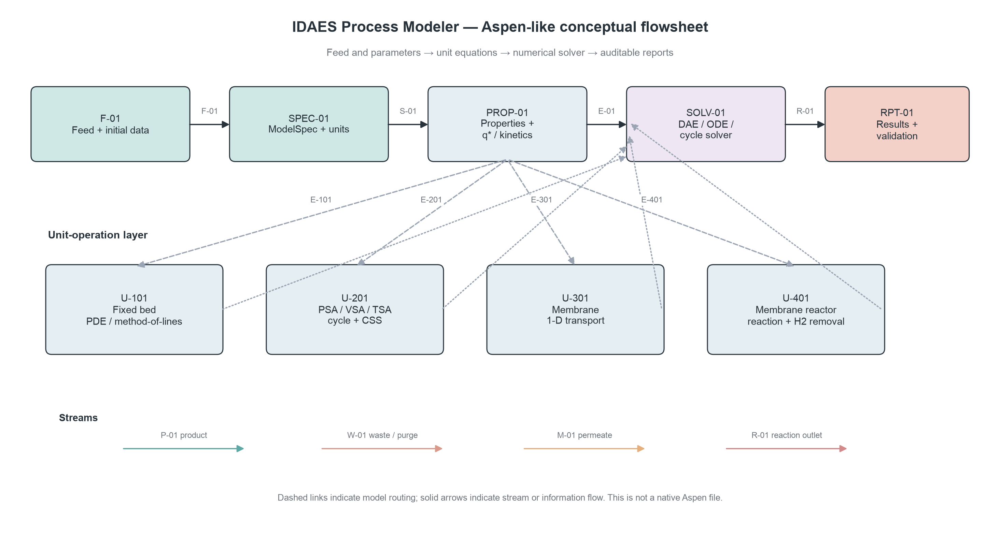
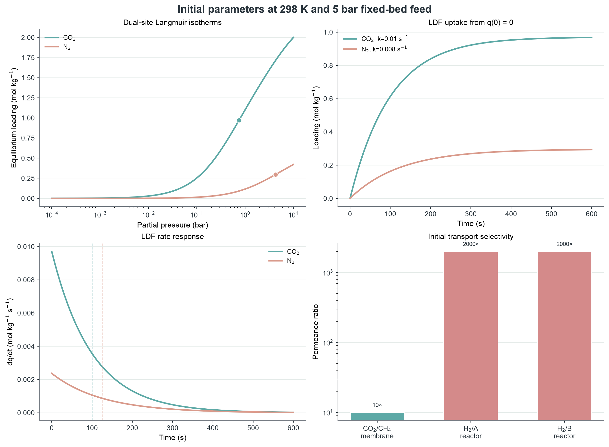
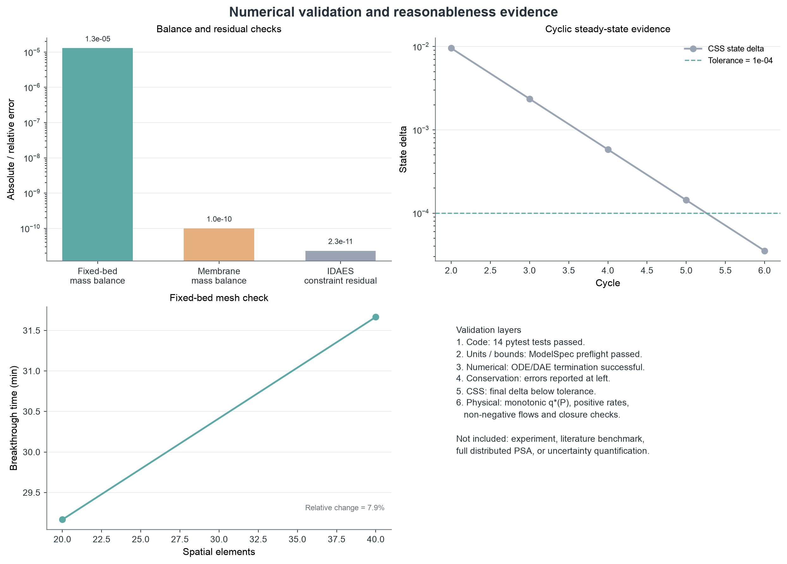

# IDAES Process Modeler Demo 技术报告

> 本报告把 demo 的结果、计算原理、建模原理、初始参数、流程图、合理性说明和验证证据放在同一条可追溯链路中。四个 reduced-order demo 用于工作流和数值演示；IDAES/Pyomo.DAE 部分是受保护的参考模型，不等同于完整工业流程模拟。

## 1. 结论先行

| Demo | 计算结果 | 证据边界 |
|---|---:|---|
| Fixed-bed adsorption | CO₂ 穿透时间 29.2 min；压降 42.8 Pa | reduced-order 1-D 数值演示 |
| PSA | CSS True（6 cycles）；纯度 0.356；回收率 0.700 | 单床 lumped cycle map |
| Membrane | 纯度 0.835；回收率 0.412；stage cut 0.197 | co-current ideal-gas 1-D 模型 |
| Membrane reactor | 转化率 0.551；渗透 H₂ 0.0117 mol/s | PFR-like reduced-order 模型 |
| IDAES reference | IPOPT optimal；DOF 0；最大残差 2.32e-11 | API/数值 smoke result，不是实验验证 |

## 2. 计算原理

### 2.1 固定床吸附

气相组分守恒采用一维非稳态对流–轴向弥散–固相吸附储存形式。当前 reduced-order 实现使用常物性和有限差分/方法线离散：

\[
\varepsilon \frac{\partial C_i}{\partial t} + u\frac{\partial C_i}{\partial z} - \varepsilon D_{ax}\frac{\partial^2 C_i}{\partial z^2} + (1-\varepsilon)\rho_s\frac{\partial q_i}{\partial t}=0.
\]

吸附平衡采用双位点 Langmuir：

\[
q_i^*=q_{s1,i}\frac{b_{1,i}P_i}{1+b_{1,i}P_i}+q_{s2,i}\frac{b_{2,i}P_i}{1+b_{2,i}P_i},\qquad P_i=y_iP.
\]

传质采用 LDF：

\[
\frac{dq_i}{dt}=k_i(q_i^*-q_i).
\]

其中当前 IDAES reference adapter 用理想气体关系 `Pᵢ = CᵢRT`，并固定温度和压力；它是 API/DAE 参考模型，不是通用 IDAES property package。

### 2.2 PSA / VSA / TSA cycle map

PSA demo 把 cycle 写成数据，而不是把步骤硬编码到求解器中。每一个 step 根据名称、持续时间、入口/出口和压力目标更新：

\[
q_{n+1}=q_n+\left[1-\exp(-k\Delta t)\right](q^*(P_{step},y_{in})-q_n).
\]

同时更新床层空隙气体库存、吸附/解吸量、产品流量和近似压力功。循环状态向量包含压力和各组分 loading；CSS 判据为：

\[
\max_j\left|\frac{x_{n,j}-x_{n-1,j}}{\max(|x_{n,j}|,1)}\right|<\varepsilon_{CSS}.
\]

### 2.3 膜分离

膜模型使用组分通量驱动的一维流率平衡：

\[
J_i=\Pi_i(P_fy_{i,f}-P_py_{i,p}),\qquad \frac{dF_{i,r}}{dz}=-J_i\frac{A}{L}.
\]

当前 demo 为 co-current、恒温恒压、理想气体近似；没有加入浓差极化和组件压降。

### 2.4 膜反应器

膜反应器同时计算化学反应和 H₂ 选择性移除：

\[
\frac{dF_i}{dz}=\nu_i r-\delta_{i,H_2}J_{H_2}\frac{A}{L},\qquad r=\frac{k(T)F_A}{u_r}.
\]

当前模型采用单一反应速率表达式和恒温恒压；没有完整 IDAES 热力学、能量平衡或多反应网络。

## 3. 建模原理和 Aspen-like 流程

流程图表达的是类似 Aspen 的工程组织方式：进料/参数 → 物性与本构关系 → 单元操作方程 → 求解器 → 物流、指标和验证。它是概念流程图，不是 Aspen Plus 原生文件，也不声称调用 Aspen 求解器。

### 单元操作和输出关系

- **U-101 Fixed bed：** 输入组成、压力、温度、床层几何、等温线和 LDF 参数；输出 breakthrough、出口组成、loading、压降诊断和守恒误差。
- **U-201 PSA：** 输入 cycle step sequence、压力高低端、purge 和 CSS 容差；输出 purity、recovery、productivity、能耗和 cycle state delta。
- **U-301 Membrane：** 输入 feed/permeate 压力、面积、长度和 permeance；输出 retentate/permeate profiles、purity、recovery、stage cut 和质量平衡。
- **U-401 Membrane reactor：** 输入化学计量、速率常数、温度、H₂ permeance 和 sweep；输出反应侧流率、渗透 H₂ 和 conversion。

## 4. 初始参数

### 4.1 Fixed-bed / PSA 吸附床

| 参数 | 初始值 | 作用 |
|---|---:|---|
| 温度 / 总压 | 298 K / 5 bar | 理想气体分压和速率参考状态 |
| 进料流量 / 组成 | 0.01 mol/s / CO₂ 0.15, N₂ 0.85 | 进料边界 |
| 床长 / 直径 | 1 m / 0.05 m | 轴向空间尺度和截面积 |
| 孔隙率 / 固体密度 | 0.4 / 1200 kg/m3 | 气相与固相库存耦合 |
| 轴向弥散 / 表观速度 | 1e-4 m2/s / 0.01 m/s | 对流–弥散项 |
| CO₂ DSL / LDF | qs₁=1.4 mol/kg, b₁=2e-5 1/Pa; qs₂=1.0 mol/kg, b₂=2e-6 1/Pa; k=0.01 1/s | 目标组分平衡和动力学 |
| N₂ DSL / LDF | qs₁=0.45 mol/kg, b₁=3e-6 1/Pa; qs₂=0.25 mol/kg, b₂=5e-7 1/Pa; k=0.008 1/s | 竞争组分平衡和动力学 |
| PSA 压力 / CSS | 5 bar ↔ 0.1 bar；容差 1e-4 | 循环边界和停止条件 |

### 4.2 膜分离和膜反应器参数

| 模块 | 关键初始参数 |
|---|---|
| Membrane | 10 bar → 0.2 bar；面积 1 m2；CO₂ permeance 5e-9 mol/(m2*s*Pa)；CH₄ permeance 5e-10 mol/(m2*s*Pa) |
| Membrane reactor | T=573 K；L=2 m；A→B+H₂；Ea=20 kJ/mol；H₂ permeance=2e-6 mol/(m2*s*Pa)；sweep=0.001 mol/s |

### 4.3 等温线、吸附速率和膜选择性

在 fixed-bed 进料状态下，CO₂ 分压为 0.750 bar，N₂ 分压为 4.250 bar；对应 DSL 平衡 loading 分别约为 CO₂ 0.970 和 N₂ 0.296 mol/kg。

图中：左上为双位点 Langmuir；右上为从 q(0)=0 的 LDF loading 响应；左下为 dq/dt；右下为膜 permeance 选择性。速率曲线不是实验速率测量，而是由初始 k 和 q* 计算出的模型响应。

## 5. 结果和合理性说明

### 5.1 Fixed-bed

CO₂ breakthrough 时间为 1750 s。出口 CO₂ 最终回到约 0.150，接近进料组成，符合床层逐渐接近饱和后分离能力下降的定性趋势。Ergun 压降约 42.8 Pa，但当前压降只作为诊断，没有反馈到浓度方程。

### 5.2 PSA

PSA 在第 6 个循环满足 CSS 判据，最终状态差 3.53e-05 < 1e-04。纯度约 35.6%、回收率约 70.0%；这说明当前参数和四步单床 lumped map 产生了可收敛的循环状态，但纯度并不高，不能把 CSS 收敛误读成工艺性能已验证。

### 5.3 Membrane

CO₂/CH₄ permeance 比为 10，模型得到 CO₂ 纯度约 0.835、回收率约 0.412。纯度和回收率的组合受面积、压比、permeance 和 feed composition 共同决定，不能单独由 selectivity 推断。

### 5.4 Membrane reactor

H₂ 对 A/B 的初始 permeance 比均为约 2000，模型得到 conversion 0.551。该趋势与“生成 H₂ 并选择性移除”这一模型设定一致，但真实反应器还需要热效应、平衡限制、传质阻力和催化剂数据。

## 6. 验证和证据等级

### 6.1 数值和守恒验证

| 检查项 | 结果 | 结论 |
|---|---:|---|
| Reduced fixed-bed BDF integration | success | 数值积分成功 |
| Fixed-bed mass-balance error | 1.29e-05 | 当前离散方程下守恒误差较小 |
| Fixed-bed mesh 20→40 elements | breakthrough 29.2→31.7 min；变化 7.9% | 仅为网格敏感性证据，不是物理验证 |
| PSA CSS | 3.53e-05 < 1e-04 | 达到设定循环收敛标准 |
| Membrane mass-balance error | 1.00e-10 | 当前 ODE 流率平衡闭合良好 |
| IDAES/Pyomo.DAE constraint residual | 2.32e-11 | 离散约束满足良好 |

### 6.2 物理合理性检查

- DSL 等温线在绘图压力范围内单调增加并趋向有限饱和值；CO₂ 的设定容量和亲和参数高于 N₂，因此模型给出更高的 CO₂ 平衡 loading。
- LDF 的 k 为正，q(t) 单调接近 q*，dq/dt 随时间衰减至零；特征时间为 1/k，CO₂ 约 100 s、N₂ 约 125 s。
- feed/purge 组成经过归一化，流率和 loading 在输出中保持非负；膜模型报告了质量平衡误差。
- 膜反应器化学计量为 A→B+H₂；图中 A 下降、B 和渗透 H₂ 增加，与设定反应方向一致。

### 6.3 尚未完成的验证

当前没有材料实验等温线、独立 LDF 速率数据、膜 permeance 实验、反应动力学数据、文献 benchmark 或 Aspen 原生 benchmark。因此本报告不能宣称实验验证、工业尺度可靠性或与 Aspen 结果等价。下一步应优先补充实测参数，建立不确定性/敏感性分析，再做完整 IDAES property package、能量平衡、压降耦合和分布式多床 PSA。

## 7. 可追溯文件

- 原始参数：`../../assets/templates/*.yaml`
- 原始结果：`../fixed_bed/`、`../psa/`、`../membrane/`、`../membrane_reactor/`、`../idaes_fixed_bed/`
- 派生参数数据：`processed_isotherms.csv`、`processed_ldf_curves.csv`、`validation_error_metrics.csv`
- 总览结果图：`../figures/demo_results_overview.png`
- 绘图脚本：`../../scripts/plot_demo_results.py`
- 本报告生成脚本：`../../scripts/build_technical_report.py`
- QA 记录：`../figures/qa_report.md`
- 本报告方法包：`method_search_packet.md`、`figure_plan.md`、`qa_report.md`

报告边界：所有数值均来自当前 demo 的机器可读输出；没有添加实验不确定度、统计显著性或未经数据支持的机理结论。
